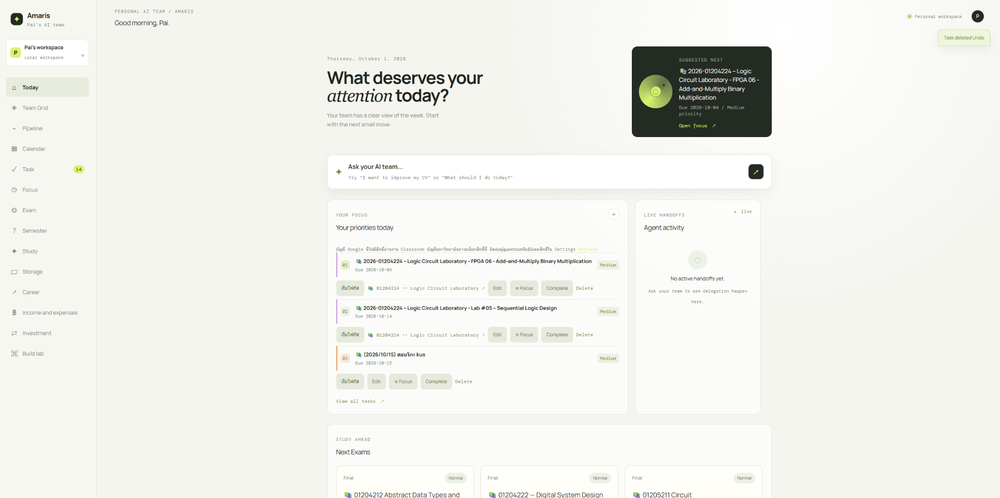
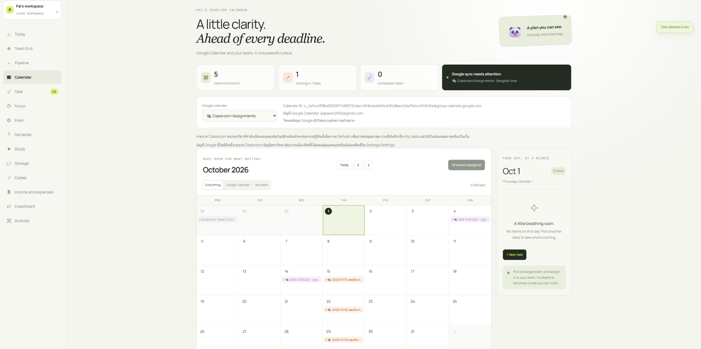
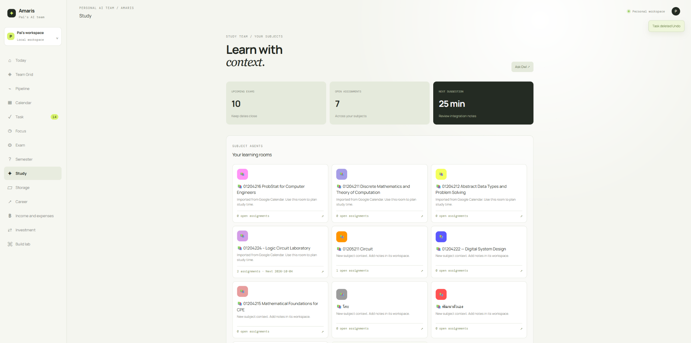

# Amaris Helper

A full-stack productivity workspace for university study, task management, career preparation, and personal projects.

## Project Status

🟢 **Active Personal Project** — Deployed and actively used as a personal productivity workspace.

The project is continuously improved as new study, productivity, and development workflows are explored.

## Live Demo

https://amarishelper.vercel.app

## Preview

### Dashboard



### Calendar

Google Calendar integration for viewing university assignments and managing deadlines.



### Study Workspace

Subject-based workspaces for organizing assignments, exams, and study planning.



## Key Features

- **Smart Dashboard** — Displays priorities, upcoming deadlines, exams, and suggested next actions in one place.
- **Task Management** — Organize tasks by deadline and priority, track completion, and focus on selected tasks.
- **Google Calendar Integration** — View Google Calendar and Classroom assignment deadlines and convert events into manageable tasks.
- **Study Workspace** — Organize subjects, assignments, exams, and study activities in dedicated subject workspaces.
- **AI Agent Workspace** — Specialized assistants for study, career preparation, project planning, development, and other workflows.
- **Cross-Device Sync** — Sign in with Google and synchronize workspace data across devices using Supabase.
- **Career & Exam Planning** — Dedicated workspaces for internship preparation, career planning, exams, and checklists.
- **Personal Management** — Includes finance tracking, investment records, file storage, focus tools, and personal project planning.

## Tech Stack

**Frontend**
- Next.js
- React
- TypeScript

**Backend**
- Next.js API Routes
- Node.js

**Database & Authentication**
- PostgreSQL
- Supabase
- Supabase Auth
- Row Level Security (RLS)

**Integrations**
- Google OAuth 2.0
- Google Calendar API
- Google Classroom Assignments via Calendar

**Development & Deployment**
- Git & GitHub
- ESLint
- Vercel

**Testing**
- Node.js Test Runner
- Integration and task logic tests


## Architecture

Amaris Helper uses a full-stack Next.js architecture with server-side integrations and optional cloud synchronization through Supabase.

```text
User
  │
  ▼
Next.js / React / TypeScript
  │
  ├── Dashboard, Tasks, Study, Career, Exam
  │
  ├── AI Agent Workspaces
  │
  └── Calendar & Personal Management
  │
  ▼
Next.js Server / API Routes
  │
  ├── Google OAuth
  ├── Google Calendar API
  └── Server-side integrations
  │
  ▼
Supabase
  ├── PostgreSQL
  ├── Authentication
  ├── Row Level Security
  └── Cross-device workspace sync
```

The application can operate in local mode using browser storage or in signed-in mode with Supabase-backed synchronization. Sensitive credentials and external API access are handled server-side rather than exposed to the browser.

### AI Agent System

Specialized agents are defined through a central registry containing their roles, capabilities, and routing information. The application uses this registry to route requests to the appropriate workspace while keeping agent configuration separate from the UI.

## Getting Started

### 1. Clone the repository

```bash
git clone https://github.com/Mamamusub/Amaris-Helper.git
cd Amaris-Helper
```

### 2. Install dependencies

```bash
npm install
```

### 3. Configure environment variables

Copy the example environment file:

```bash
cp .env.example .env.local
```

Fill in the required environment variables for the integrations you want to use. Keep API keys and secrets in `.env.local` and never commit them to the repository.

### 4. Start the development server

```bash
npm run dev
```

Open `http://localhost:3000` in your browser.

### 5. Verify the project

```bash
npm run lint
npm run build
node --test tests/*.test.mjs
```

The application can run in local mode without Supabase. Google Login, cross-device synchronization, Calendar integration, and other external services require their respective environment variables and configuration.

## AI Agent Team

Amaris Helper includes specialized agents designed for different student and development workflows.

| Agent | Role |
| --- | --- |
| 🐼 Panda | Secretary & task coordination |
| 🦉 Owl | Research assistance |
| 🦅 Eagle | Content and work review |
| 🐶 Dog | Career coaching |
| 🐱 Cat | CV and resume review |
| 🦊 Fox | Project idea generation |
| 🐝 Bee | Product planning |
| 🦫 Beaver | Web development |
| 🦋 Butterfly | UI/UX design |
| 🐙 Octopus | Code review |

Each agent has a defined role and capability set, allowing requests to be routed to the appropriate workspace.

## Integrations

### Google Calendar & Classroom

Amaris Helper connects with Google Calendar to bring university schedules and deadlines into the workspace.

- View Google Calendar events directly inside the application
- Access Classroom assignment deadlines through the Classroom Assignments calendar
- Convert Google events into local tasks
- Filter between Google Calendar events and personal tasks
- Export local tasks to Google Calendar
- Handle calendar data using the Asia/Bangkok timezone

### Google Authentication & Supabase

Users can sign in with Google through Supabase Auth to synchronize their workspace across devices.

- Google OAuth authentication
- PostgreSQL-backed workspace synchronization
- Row Level Security (RLS) for user data isolation
- Local mode available without an account
- Import existing local data when signing in

Detailed setup instructions are available in [`docs/google-login-sync.md`](docs/google-login-sync.md).

## AI-Assisted Workflow

Amaris Helper includes a manual AI-assisted workflow that organizes requests through specialized agent roles without requiring a built-in external AI API.

- Route requests based on specialized agent roles
- Generate structured prompts for use with ChatGPT
- Attach PNG, JPEG, and WebP images as supporting context
- Store previous workflow runs and responses for later reference
- Keep AI interaction user-controlled through a manual copy-and-paste workflow

## Data & Synchronization

Amaris Helper supports both local-first usage and account-based synchronization.

- Tasks are shared across Today, Tasks, Study, and Calendar views
- Local data remains available without requiring an account
- Signed-in users can synchronize workspace data across devices
- Supabase PostgreSQL stores account-linked workspace data
- Row Level Security (RLS) isolates data between users
- Existing local workspace data can be imported into a signed-in account

## Future Improvements

- Expand Google Workspace integrations for academic workflows
- Improve mobile responsiveness and accessibility
- Add richer analytics for study progress and productivity
- Expand file and resource management across workspaces
- Improve AI agent routing and workflow automation
- Add more automated testing for critical user flows


Synchronized workspace data includes tasks, study information, career planning, exams and checklists, finance records, projects, preferences, focus sessions, and private workspace files.
